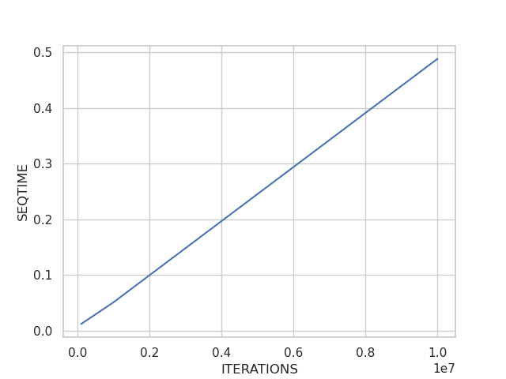

# Proyecto: Cálculo paralelo de $\pi$ usando la función `ran2` con OpenMP

## CINVESTAV - Departamento de computación

### Autor: André Fabián Castellanos Aldama

### 1 de Diciembre del 2021

<br>

**El código lo puede encontrar en el siguiente [link](https://github.com/acastellanos95/piRandomOpenMP)**

### Objetivo

1. Calcular secuencialmente $\pi$ con `ran2`.
2. Implementar `ran2` como la clase `Ran2T` para usar una solución paralela.
3. Calcular con `Ran2T` el valor de $\pi$.
4. Presentar resultados y tiempos de ejecución.

### Problema

Actualmente se conocen muchas maneras de calcular $\pi$ unas más rápidas que otras y algunos que otorgan mayor exactitud por cada iteración. Sin embargo, para este proyecto utilizaremos el método Montecarlo para calcular $\pi$.

### Método Montecarlo

Las simulaciones Montecarlo son algoritmos o experimentos que se basan en el muestreo de números aleatorios. Este experimento se repite un grán número de veces para estimar algo que podría ser estimado deterministicamente como $\pi$.

#### Cálculo de $\pi$

Sabemos como calcular deterministicamente el aŕea de un cuadrado y un círculo, $A=l^2$ y $A=\pi r^2$ respectivamente. Supongamos el cuadrado unitario que encierra un cuarto del área del círculo unitario en el primer cuadrante como se muestra:


_Figura 1. Cuadrado unitario que encierra un cuarto del círculo unitario en el primer cuadrante._

Ahora bien, si aleatoriamente pusieramos puntos dentro de este cuadrado y además conforme el número de estos puntos sea mayor, estaríamos cubriendo el área del cuadrado y el cuarto del área del círculo unitario. Encontraríamos la relación siguiente:

$$
  \frac{\text{Área círculo}}{\text{Área cuadrado}} = \frac{\text{Número puntos dentro de fracción del círculo}}{\text{Número puntos en cuadrado}}\\
  =\frac{\pi \cdot (1)^2 / 4}{1\cdot 1}\\
  \leftrightarrow \pi = 4 \cdot \frac{\text{Número puntos dentro de fracción del círculo}}{\text{Número puntos en cuadrado}}
$$

### Implementación secuencial usando `ran2`

La implementación del cálculo de $\pi$ es como sigue:

```C++
/* Programa Secuencial: no me gustaría que estuviera aquí la función pero es bueno para enseñar la diferencias*/
double t_seq_init = omp_get_wtime();
long inp = -1;
/*Calculate pi*/
long eb = 0;
long te = num_iterations;
for (int i = 0; i < te; ++i) {
  float x = ran2(&inp);
  float y = ran2(&inp);
  if((x*x+y*y) <= 1.0)
    eb++;
}
double t_seq_fin = omp_get_wtime();

std::cout << "pi es: " << (float) eb/ (float) te*4 << std::endl;
std::cout << "tiempo secuencial es: " << t_seq_fin - t_seq_init << "s" << std::endl;
```

`inp` es igual a $-1$ porque según en el libro numerical recipes in C se pide que se inicialice con un número negativo y después solo se siga pasando la misma referencia de este número. Lamentablemente como lo comenta el libro, para el mismo número negativo de inicialización generará la misma secuencia de números.

### Implementación de la clase `Ran2`

Para poder hacer una implementación del algoritmo de manera paralela necesitamos que cada hilo tenga su instancia de la función `ran2` con un número negativo diferente para inicializar. Para eso lo implementamos como sigue:

```C++
typedef struct{
  long idum;
  long idum2;
  long iy;
  long iv[32];
} ran2NR;

class Ran2 {
  ran2NR _r;
  unsigned int _id;
 public:
  Ran2() = default;
  explicit Ran2(int inum_init, unsigned int id);
  float ran2T();
};

float Ran2::ran2T() {
  int j;
  long k;
  float temp;

  if(this->_r.idum <= 0){
    if (-(this->_r.idum) < 1) this->_r.idum=1;
    else this->_r.idum = -(this->_r.idum);
    this->_r.idum2 = (this->_r.idum);
    for (j = NTAB+7; j >= 0; j--) {
      k = (this->_r.idum)/IQ1;
      this->_r.idum = IA1*(this->_r.idum-k*IQ1)-k*IR1;
      if (this->_r.idum < 0) this->_r.idum += IM1;
      if (j < NTAB) this->_r.iv[j] = this->_r.idum;
    }
    this->_r.iy = this->_r.iv[0];
  }

  k = (this->_r.idum)/IQ1;
  this->_r.idum = IA1*(this->_r.idum-k*IQ1)-k*IR1;
  if (this->_r.idum < 0) this->_r.idum += IM1;
  k = this->_r.idum2/IQ2;
  this->_r.idum2 = IA2*(this->_r.idum2-k*IQ2)-k*IR2;
  if (this->_r.idum2 < 0) this->_r.idum2 += IM2;
  j = this->_r.iy/NDIV;
  this->_r.iy = this->_r.iv[j]-this->_r.idum2;
  this->_r.iv[j] = this->_r.idum;
  if (this->_r.iy < 1) this->_r.iy += IMM1;

  if ((temp=AM*this->_r.iy) > RNMX) return RNMX;
  else return temp;
}

Ran2::Ran2(int idum_init, unsigned int id) {
  this->_r.idum = idum_init;
  this->_id = id;
}
```

Esta clase nos permitirá que cada hilo tenga su instancia de `Ran2` con su respectiva función `ran2T`.

### Implementación de la solución paralela

Representa un reto el que cada hilo tenga una instancia de `ran2` con su respectiva función `ran2T` con diferentes números negativos. Esto podemos solucionarlo haciendo un arreglo de instancias de `ran2T` con número de inicialización asociado al hilo donde corre pero negativo para que cada hilo tenga una secuencia de números diferentes.

Además para guardar el número de puntos en el círculo debemos usar una reducción, este no es necesario que por hilo tenga su propio contador ya que comparten para la solución final el mismo denominador $\text{num puntos circulo hilo 1}/\text{num puntos creados}+...+\text{num puntos circulo hilo n}/\text{num puntos creados}$.

La implementación es como sigue:

```C++
/*Crear vector de clase Ran2 e inicializar*/
  double t_seq_par_init = omp_get_wtime();
  auto *rans = new std::vector<Ran2>();
  int num_threads = omp_get_max_threads();
  for (int i = 0; i < num_threads; ++i) {
    rans->emplace_back(Ran2(-((int) i+1), i));
  }

  /*Imprimir tamaño de vector*/
//  std::cout << "tamaño de vector después de inicialización: " << rans->size() << std::endl;

  /*Calculo de pi*/

  int ebT=0;

  #pragma omp parallel for default(none) shared(rans, num_iterations) reduction(+:ebT)
  for (int i = 0; i < num_iterations; ++i) {
    /*Debug printing*/
//    printf("indice: %d\t", i);
//    printf("thread: %d, ran2=%f\n",thread_num, rans->at(thread_num).ran2T());

    int thread_num = omp_get_thread_num();
    float x = rans->at(thread_num).ran2T();
    float y = rans->at(thread_num).ran2T();
    if((x*x+y*y) <= 1.0)
      ebT++;
  }

  std::cout << "pi es: " << (float) ebT/ (float) num_iterations*4 << std::endl;

  double t_seq_par_fin = omp_get_wtime();
  std::cout << "tiempo paralelo es: " << t_seq_par_fin - t_seq_par_init << "s" << std::endl;
```

### Resultados

#### Prueba

En el ejemplo secuencial el valor de inicio es $-1$ que es como se inicializa `Ran2` para el hilo 0. ESto significa que si ejecutamos para un solo hilo. La solución secuencial y la paralela deberían coincidir los resultados. Ejecutando para un solo hilo y los siguientes número de puntos 1000, 10000, 100000, 1000000, 10000000.

```bash
pi secuencial es: 3.104, tiempo secuencial es: 0.000148441s, pi paralelo es: 3.104, tiempo paralelo es: 0.000375351s
pi secuencial es: 3.1524, tiempo secuencial es: 0.000661592s, pi paralelo es: 3.1524, tiempo paralelo es: 0.00110507s
pi secuencial es: 3.14636, tiempo secuencial es: 0.0066691s, pi paralelo es: 3.14636, tiempo paralelo es: 0.009459s
pi secuencial es: 3.14155, tiempo secuencial es: 0.0533191s, pi paralelo es: 3.14155, tiempo paralelo es: 0.0656643s
pi secuencial es: 3.14173, tiempo secuencial es: 0.429616s, pi paralelo es: 3.14173, tiempo paralelo es: 0.655632s
```

Observamos que obtenemos el mismo valor de $\pi$ en todos los casos como esparabamos. Otro dato interesante es que podemos ver como el overhead de usar el framework OpenMP hace que en el caso de la ejecución de un hilo es más tardado que la solución secuencial.

#### Comparaciones

Se ejecutó para los número de puntos 100000, 1000000 y 10000000 con 2,4,6,8,10,12 hilos. A continuación se presentan la gráfica con los resultados.



_Figura 2. Iteraciones contra tiempo en segundos de la solución secuencial para el número de puntos generados 100000, 1000000 y 10000000. Aunque no se observan los puntos claramente, queda demostrado que la complejidad del problema secuencial es lineal._


_Figura 3. Número de hilos contra tiempo de ejecución en segundos con su curva respectivamente etiquetada con el número de puntos generados. Podemos notar como el tiempo de ejecución se reduce con cada aumento de hilos de 2 a 12._


_Figura 4. Valor de $\pi$ contra el número de hilos etiquetados por el número de puntos creados. Se puede observar que en general a menor número de puntos creados menos es la precisión del valor de $\pi$ encontrado._

#### Aceleración


_Figura 5. Aceleración contra número de hilos etiquetados por el número de puntos creados. Se observa que en general conforme aumentamos el número de hilos usados la acelaración crece como se esperaba._

### Conclusiones

Los resultados encontrados apuntan a una buena implementación de la solución tanto secuencial como paralela. Se redujo el tiempo de ejecución usando paralelismo que es más notorio cuando se crean más número de puntos.

Con respecto a la aceleracíon, encontramos lo que se esperaba excepto porque la aceleración para 100000 puntos creados con 2 hilos es mayor que el de 4. Esto podría deberse a que el tiempo por overhead fue mayor que el tiempo de ejecución secuencial por el hecho de haber usado pocos puntos.

Sería interesante para un mayor número de puntos de tal manera que encontraramos tiempos de ejecución de minutos, sin embargo, con el número de puntos resulta suficiente para presentar resultados que en general son como esperabamos.
